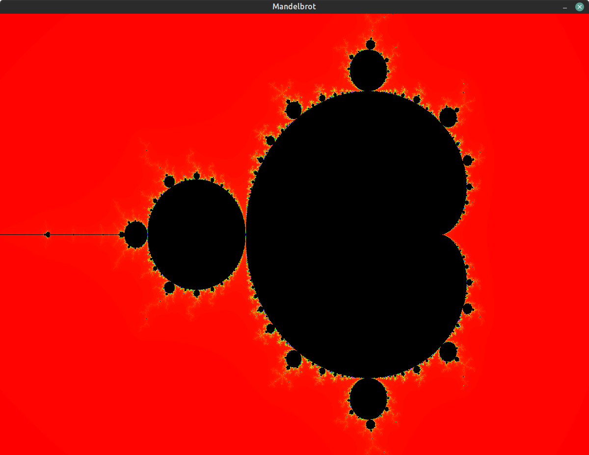

# Mandelbrot
A simple mandelbrot set plotter made with C++ and SDL library

### Resolution 
You can modify the const value inside Game.hpp called cMaxIter to get better or worse rendering quality.

### Controls
- Press arrow keys to move
- Press W or S to either zoom in or zoom out

## Compilation
You'll need to either compile it yourself or use the premade Makefile.

## Example

